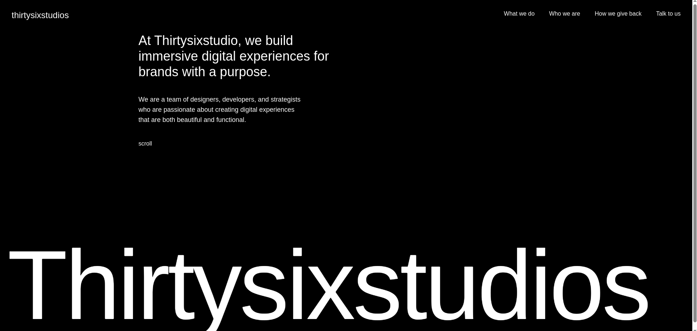
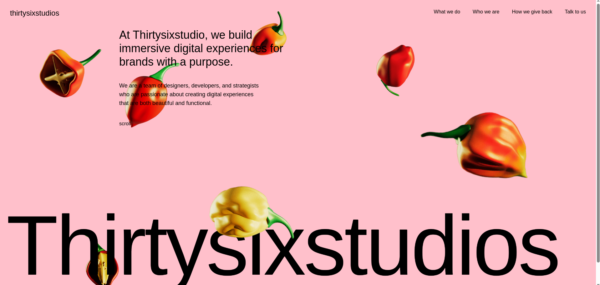

# Thirty Six Studios – Awaards Website Clone (Landing Page)

This project is a **React-based clone** of the landing page from Thirty Six Studios' *"Awaards Winning Website"*. It replicates the visual experience and interactivity using modern web technologies and animations.

## 🚀 Features

- ⚛️ Built with **React** (Vite/CRA)
- 🎞️ Smooth and subtle animations
- 💡 Modern design and clean layout
- 📱 Fully responsive for mobile and desktop

## 🖼️ Screenshots




## 🎥 Demo Video

<video width="100%" controls>
  <source src="public/Screencast.webm" type="video/webm">
  Your browser does not support the video tag.
</video>

## 📁 Folder Structure (Simplified)

```
📁 public
│   ├── Screenshot1.jpg
│   ├── Screenshot2.jpg
│   └── Screencast1.webm
📁 src
│   ├── assets/
│   ├── components/
│   ├── App.jsx
│   ├── main.jsx
│   └── canvas.jsx
|
├── package.json
├── README.md
```

## 🛠️ Tech Stack

- **React** – JavaScript UI library
- **HTML5/CSS3** – Markup and styling
- **GSAP** – for animations
- **CANVAS** - for parsing images into smooth effects

## 🚧 Getting Started

Clone the repository and run it locally:

```bash
git clone https://github.com/yourusername/ThirtySixStudios.git
cd ThirtySixStudios
npm install
npm run dev  # or npm start if using CRA
```

## 📄 License

This project is for educational and demonstrative purposes only and is **not affiliated** with Thirty Six Studios.

## 👨‍💻 Author

Created by [Siddharth](https://github.com/sidd190) – feel free to fork and check out!
